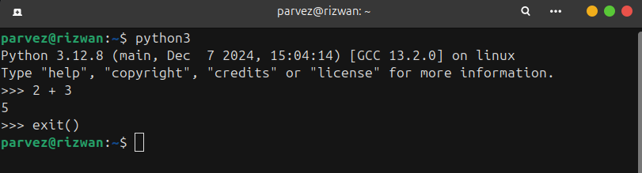

# Python Basic

<strong>Learn with Parvez by joining the upcoming [<em>CODING BOOTCAMP</em>](https://mekhanparvez.com) </strong>

| Day |           Topics            |
| --- | :-------------------------: |
| 01  | [Introduction](./readme.md) |

<div>
<small>Support the <strong>author</strong> to create more educational materials</small> <br />
<a href = "https://www.paypal.me">

</a>
</div>

<div align="center">
  <h1>Python Basics : Day 1 - Introduction</h1>
  <a class="header-badge" target="_blank" href="/">
  
  </a>
  <!-- <a class="header-badge" target="_blank" href="/">
   -->
  </a>

  <sub>Author:
  <a href="https://www.linkedin.com/in/mekhanparvez/" target="_blank">Parvez</a><br>
  <small> First Edition: December, 2024</small>
  </sub>
</div>

[Day 2 >>](./Day_02)

- [Python Basic](#python-basic)
- [📘 Day 1](#-day-1)
  - [Welcome](#welcome)
  - [Introduction](#introduction)
  - [Why Python ?](#why-python-)
  - [Environment Setup](#environment-setup)
    - [Installing Python](#installing-python)
    - [Python Shell](#python-shell)
    - [Installing Visual Studio Code](#installing-visual-studio-code)
      - [How to use visual studio code](#how-to-use-visual-studio-code)
  - [Basic Python](#basic-python)
    - [Python Syntax](#python-syntax)
    - [Python Indentation](#python-indentation)
    - [Comments](#comments)
    - [Data types](#data-types)
      - [Number](#number)
      - [String](#string)
      - [Booleans](#booleans)
      - [List](#list)
      - [Dictionary](#dictionary)
      - [Tuple](#tuple)
      - [Set](#set)
    - [Checking Data types](#checking-data-types)
    - [Python File](#python-file)
  - [💻 Exercises - Day 1](#-exercises---day-1)
    - [Exercise: Level 1](#exercise-level-1)
    - [Exercise: Level 2](#exercise-level-2)
    - [Exercise: Level 3](#exercise-level-3)

# 📘 Day 1

## Welcome

**Congratulations** for deciding to participate in a _Python_ programming challenge. In this challenge, you will learn everything you need to be a python programmer and the whole concept of programming. 
<!-- At the end of the challenge -->

<!-- If you would like to actively engage in the challenge, you may join the [30DaysOfPython challenge](https://t.me/ThirtyDaysOfPython) telegram group.   -->

## Introduction

- A general-purpose, high-level programming language
- An open source, interpreted, objected-oriented programming language. 
- Was created by a Dutch programmer, Guido van Rossum. 
- The name of the Python programming language was derived from a British sketch comedy series, *Monty Python's Flying Circus*.
- The first version was released on February 20, 1991.

This Python challenge will help you learn the latest version of Python, Python 3 step by step.
<!-- The topics are broken down into 30 days, where each day contains several topics with easy-to-understand explanations, real-world examples, and many hands on exercises and projects. -->

This challenge is designed for beginners and professionals who want to learn python programming language. It may take 30 to 100 days to complete the challenge.
<!-- People who actively participate in the telegram group have a high probability of completing the challenge. -->

This challenge is easy to read, written in conversational English, engaging, motivating and at the same time, it is very demanding. You need to allocate much time to finish this challenge. 
<!-- If you are a visual learner, you may get the video lesson on <a href="https://www.youtube.com/channel/UC7PNRuno1rzYPb1xLa4yktw"> Washera</a> YouTube channel. You may start from [Python for Absolute Beginners video](https://youtu.be/OCCWZheOesI). Subscribe the channel, comment and ask questions on YouTube vidoes and be proactive, the author will eventually notice you. -->

The author likes to hear your opinion about the challenge, share the author by expressing your thoughts about the Python challenge. You can leave your testimonial on this [link]()

## Why Python ?

- A "high-level" (human readable - not machine code) general purpose open source programming language
- Used to develop web applications, desktop applications, system administration, and machine learning libraries. 
- A highly embraced language in the data science and machine learning community. 
- Has vast quantities of freely accessible libraries that can be integrated into projects.

I hope this is enough to convince you to start learning Python. Python is eating the world and you are killing it before it eats you.

## Environment Setup

### Installing Python

To run a python script you need to install python. Let's [download](https://www.python.org/downloads) python.
If your are a windows user. Click the button encircled in red.

[](https://www.python.org/downloads/windows/)

If you are a macOS user. Click the button encircled in red.

[](https://www.python.org/)

To check if python is installed write the following command on your device terminal.

```shell
python3 --version
```


As you can see from the terminal, I am using _Python 3.12.3_ version at the moment. Your version of Python might be different from mine by but it should be 3.6 or above. If you manage to see the python version, well done. Python has been installed on your machine. Continue to the next section.

### Python Shell

Python is an interpreted scripting language, so it does not need to be compiled. It means it executes the code line by line. Python comes with a _Python Shell (Python Interactive Shell)_. It is used to execute a single python command and get the result.

Python Shell waits for the Python code from the user. When you enter the code, it interprets the code and shows the result in the next line.
Open your terminal or command prompt(cmd) and write:

```shell
python
```


The Python interactive shell is opened and it is waiting for you to write Python code(Python script). You will write your Python script next to this symbol >>> and then click Enter.
Let us write our very first script on the Python scripting shell.


Well done, you wrote your first Python script on Python interactive shell. How do we close the Python interactive shell ?
To close the shell, next to this symbol >> write **exit()** command and press Enter.



Now, you know how to open the Python interactive shell and how to exit from it.

Python will give you results if you write scripts that Python understands, if not it returns errors. Let's make a deliberate mistake and see what Python will return.


As you can see from the returned error, Python is so clever that it knows the mistake we made and which was _Syntax Error: invalid syntax_. Using `x` as multiplication in Python is a syntax error because `x` is not a valid syntax in Python. Instead of **`x`** we use asterisk `*` for multiplication. The returned error clearly shows what to fix.

The process of identifying and removing errors from a program is called _`debugging`_. Let us debug it by putting `*` in place of **`x`**.


Our bug was fixed, the code ran and we got a result we were expecting. As a programmer you will see such kind of errors on daily basis. It is good to know how to debug. To be good at debugging you should understand what kind of errors you are facing. Some of the Python errors you may encounter are _`SyntaxError`_, _`IndexError`_, _`NameError`_, _`ModuleNotFoundError`_, _`KeyError`_, _`ImportError`_, _`AttributeError`_, _`TypeError`_, _`ValueError`_, _`ZeroDivisionError`_ etc. We will see more about different Python **_error types_** in later sections.

Let us practice more how to use Python interactive shell. Go to your terminal or command prompt and write the word **`python3`**.


The Python interactive shell is opened. Let us do some basic mathematical operations (addition, subtraction, multiplication, division, modulus,  exponential).

Let us do some maths first before we write any Python code:

- `2 + 3` is `5`
- `3 - 2` is `1`
- `3 * 2` is`6`
- `3 / 2` is `1.5`
- `3 ** 2` is the same as `3 * 3`

In python we have the following additional operations:

- `3 % 2` = `1` => which means finding the `remainder`
- `3 // 2` = `1` => which means removing the `remainder`

Let us change the above mathematical expressions to Python code. The Python shell has been opened and let us write a comment at the very beginning of the shell.

A _`comment`_ is a part of the code which is not executed by python. So we can leave some text in our code to make our code more readable. Python does not run the comment part. A comment in python starts with hash `#` symbol.
This is how you write a comment in python

```shell
 # comment starts with hash
 # this is a python comment, because it starts with a (#) symbol
```


Before we move on to the next section, let us practice more on the Python interactive shell. Close the opened shell by writing _exit()_ on the shell and open it again and let us practice how to write text on the Python shell.


**Exercise:** Find the `Strings` and `Comments` from the above codes/statements

### Installing Visual Studio Code

The Python interactive shell is good to try and test small script codes but it will not be for a big project. In real work environment, developers use different code editors to write codes. In this 30 days of Python programming challenge we will use visual studio code. Visual studio code is a very popular open source text editor. I am a fan of vscode and I would recommend to [download](https://code.visualstudio.com/) visual studio code, but if you are in favor of other editors, feel free to follow with what you have.

[](https://code.visualstudio.com/)

If you installed visual studio code, let us see how to use it.
If you prefer a video, you can follow this Visual Studio Code for Python [Video tutorial](https://www.youtube.com/)

#### How to use visual studio code

Open the visual studio code by double clicking the visual studio icon. When you open it you will get this kind of interface. Try to interact with the labeled icons.


Create a folder named 30DaysOfPython on your desktop. Then open it using visual studio code.


After opening it you will see shortcuts for creating files and folders inside of 30DaysOfPython project's directory. As you can see below, I have created the very first file, helloworld.py. You can do the same.


After a long day of coding, you want to close your code editor, right? This is how you will close the opened project.


Congratulations, you have finished setting up the development environment. Let us start coding.

## Basic Python

### Python Syntax

A Python script can be written in Python interactive shell or in the code editor. 
- A Python file has an extension .py.

### Python Indentation

An indentation is a white space in a text. Indentation in many languages is used to increase code readability; however, Python uses indentation to create blocks of code. In other programming languages, curly brackets are used to create code blocks instead of indentation. One of the common bugs when writing Python code is incorrect indentation.


### Comments

Comments play a crucial role in enhancing code readability and allowing developers to leave notes within their code. In Python, any text preceded by a hash (#) symbol is considered a comment and is not executed when the code runs.

**Example: Single Line Comment**

```shell
    # This is the first comment
    # This is the second comment
    # Python is eating the world
```

**Example: Multiline Comment**

Triple quote can be used for multiline comment if it is not assigned to a variable

```shell
"""This is multiline comment
multiline comment takes multiple lines.
python is eating the world
"""
```

### Data types

In Python there are several types of data types. Let us get started with the most common ones. Different data types will be covered in detail in other sections. For the time being, let us just go through the different data types and get familiar with them. You do not have to have a clear understanding now.

#### Number

- `Integer` Integer(negative, zero and positive) numbers
    Example:
    ... -3, -2, -1, 0, 1, 2, 3 ...
- `Float` Decimal number
    Example:
    ... -3.5, -2.25, -1.0, 0.0, 1.1, 2.2, 3.5 ...
- Complex Example:
    1 + j, 2 + 4j

#### String

A collection of one or more characters under a single or double quote. If a string is more than one sentence then we use a triple quote.

**Example:**

```py
'Asabeneh'
'Finland'
'Python'
'I love teaching'
'I hope you are enjoying the first day of 30DaysOfPython Challenge'
```

#### Booleans

A boolean data type is either a `True` or `False` value. T and F should be always uppercase.

**Example:**

```python
    True  #  Is the light on? If it is on, then the value is True
    False # Is the light on? If it is off, then the value is False
```

#### List

Python list is an ordered collection which allows to store different data type items. A list is similar to an array in JavaScript.

**Example:**

```py
[0, 1, 2, 3, 4, 5]  # all are the same data types - a list of numbers
['Banana', 'Orange', 'Mango', 'Avocado'] # all the same data types - a list of strings (fruits)
['Finland','Estonia', 'Sweden','Norway'] # all the same data types - a list of strings (countries)
['Banana', 10, False, 9.81] # different data types in the list - string, integer, boolean and float
```

#### Dictionary

A Python dictionary object is an unordered collection of data in a key value pair format.

**Example:**

```py
{
'first_name':'Asabeneh',
'last_name':'Yetayeh',
'country':'Finland', 
'age':250, 
'is_married':True,
'skills':['JS', 'React', 'Node', 'Python']
}
```

#### Tuple

A tuple is an ordered collection of different data types like list but tuples can not be modified once they are created. They are immutable.

**Example:**

```py
('Asabeneh', 'Pawel', 'Brook', 'Abraham', 'Lidiya') # Names
```

```py
('Earth', 'Jupiter', 'Neptune', 'Mars', 'Venus', 'Saturn', 'Uranus', 'Mercury') # planets
```

#### Set

A set is a collection of data types similar to list and tuple. Unlike list and tuple, set is not an ordered collection of items. Like in Mathematics, set in Python stores only unique items.

In later sections, we will go in detail about each and every Python data type.

**Example:**

```py
{2, 4, 3, 5}
{3.14, 9.81, 2.7} # order is not important in set
```

### Checking Data types

To check the data type of certain data/variable we use the **type** function. In the following terminal you will see different python data types:


### Python File

First open your project folder, `python-basic`. If you don't have this folder, create a folder name called `python-basic`. Inside this folder, create a file called `intro.py`. Now, let's do what we did on python interactive shell using visual studio code.

The Python interactive shell was printing without using **`print`** but on visual studio code to see our result we should use a built in function _`print()`_. The _`print()`_ built-in function takes one or more arguments as follows _`print('arument1', 'argument2', 'argument3')`_. See the examples below.

**Example:**

The file name is `intro.py`

```py
# Day 1 - Python Challenge

print(2 + 3)             # addition(+)
print(3 - 1)             # subtraction(-)
print(2 * 3)             # multiplication(*)
print(3 / 2)             # division(/)
print(3 ** 2)            # exponential(**)
print(3 % 2)             # modulus(%)
print(3 // 2)            # Floor division operator(//)

# Checking data types
print(type(10))          # Int
print(type(3.14))        # Float
print(type(1 + 3j))      # Complex number
print(type('Asabeneh'))  # String
print(type([1, 2, 3]))   # List
print(type({'name':'Asabeneh'})) # Dictionary
print(type({9.8, 3.14, 2.7}))    # Set
print(type((9.8, 3.14, 2.7)))    # Tuple
```

To run the python file check the image below. You can run the python file either by running the green button on Visual Studio Code or by typing _python intro.py_ in the terminal .


🌕  You are amazing. You have just completed day 1 challenge and you are on your way to greatness. Now do some exercises for your brain and muscles.

## 💻 Exercises - Day 1

### Exercise: Level 1

1. Check the python version you are using
2. Open the python interactive shell and do the following operations. The operands are 3 and 4.
   - addition(+)
   - subtraction(-)
   - multiplication(\*)
   - modulus(%)
   - division(/)
   - exponential(\*\*)
   - floor division operator(//)
3. Write strings on the python interactive shell. The strings are the following:
   - Your name
   - Your family name
   - Your country
   - I am enjoying 30 days of python
4. Check the data types of the following data:
   - 10
   - 9.8
   - 3.14
   - 4 - 4j
   - ['Asabeneh', 'Python', 'Finland']
   - Your name
   - Your family name
   - Your country

### Exercise: Level 2

1. Create a folder named day_1 inside 30DaysOfPython folder. Inside day_1 folder, create a python file helloworld.py and repeat questions 1, 2, 3 and 4. Remember to use _print()_ when you are working on a python file. Navigate to the directory where you have saved your file, and run it.

### Exercise: Level 3

1. Write an example for different Python data types such as Number(Integer, Float, Complex), String, Boolean, List, Tuple, Set and Dictionary.
2. Find an [Euclidian distance](https://en.wikipedia.org/wiki/Euclidean_distance#:~:text=In%20mathematics%2C%20the%20Euclidean%20distance,being%20called%20the%20Pythagorean%20distance.) between (2, 3) and (10, 8)

🎉 CONGRATULATIONS ! 🎉

[Day 2 >>](./02_Day_Variables_builtin_functions/02_variables_builtin_functions.md)